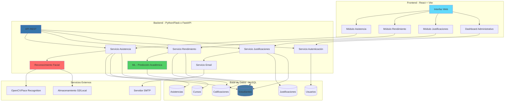
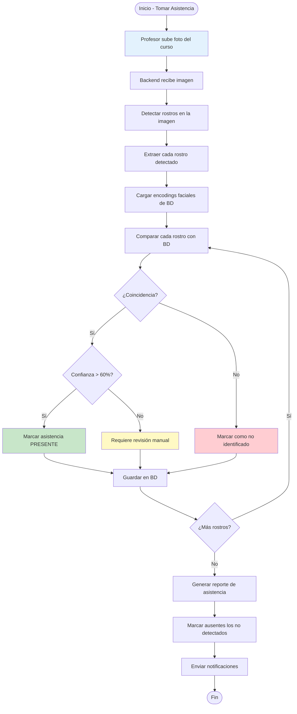
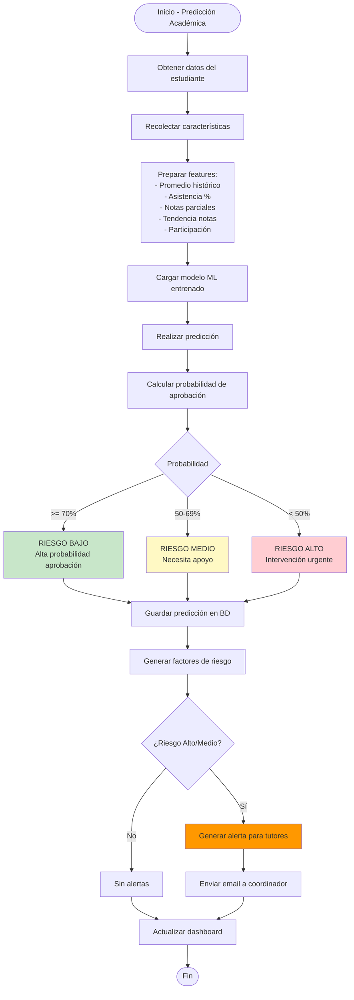
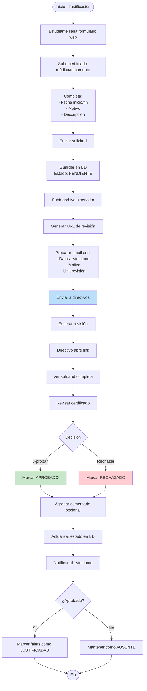
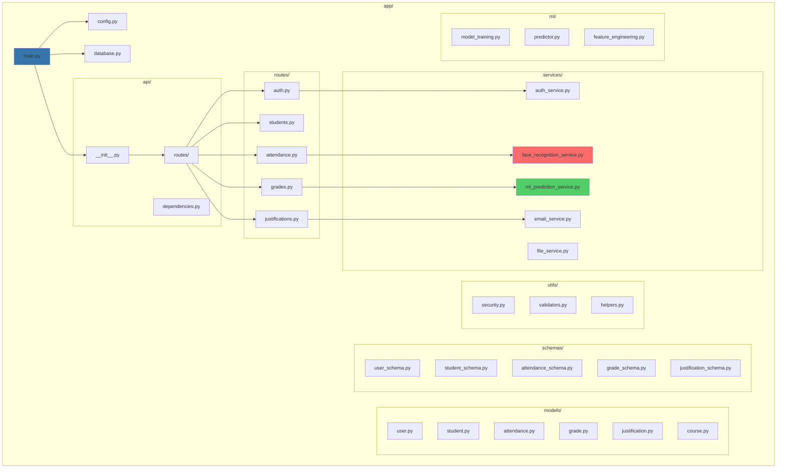
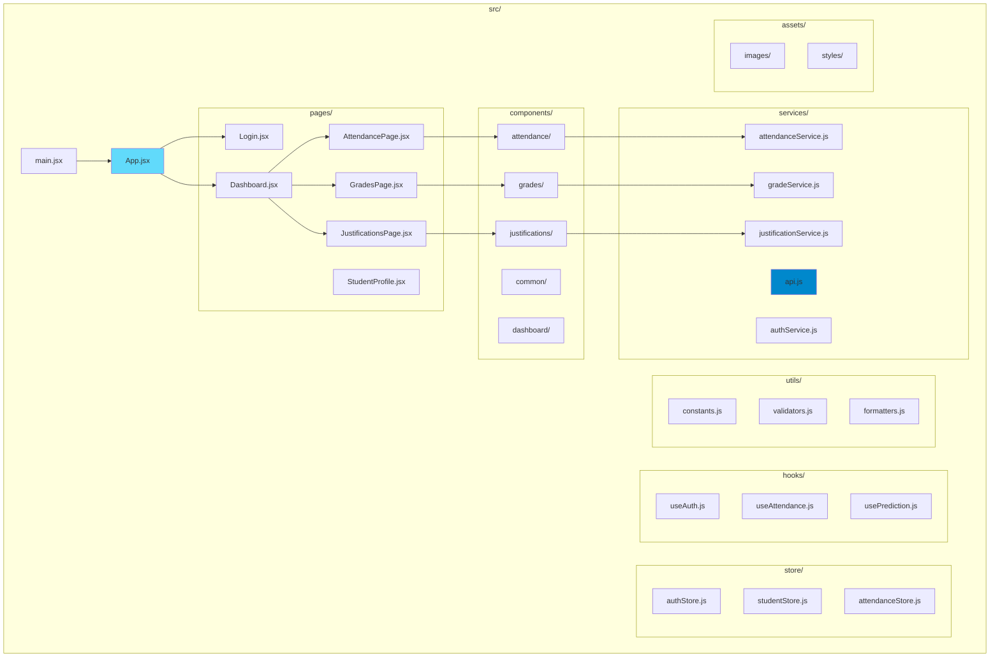
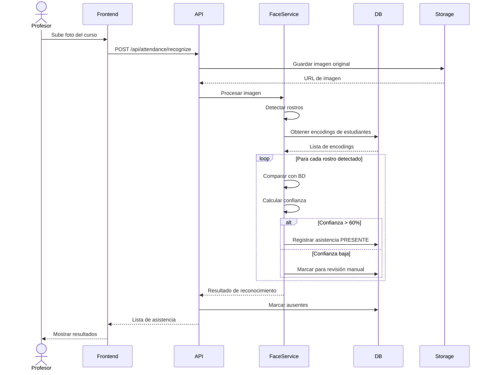
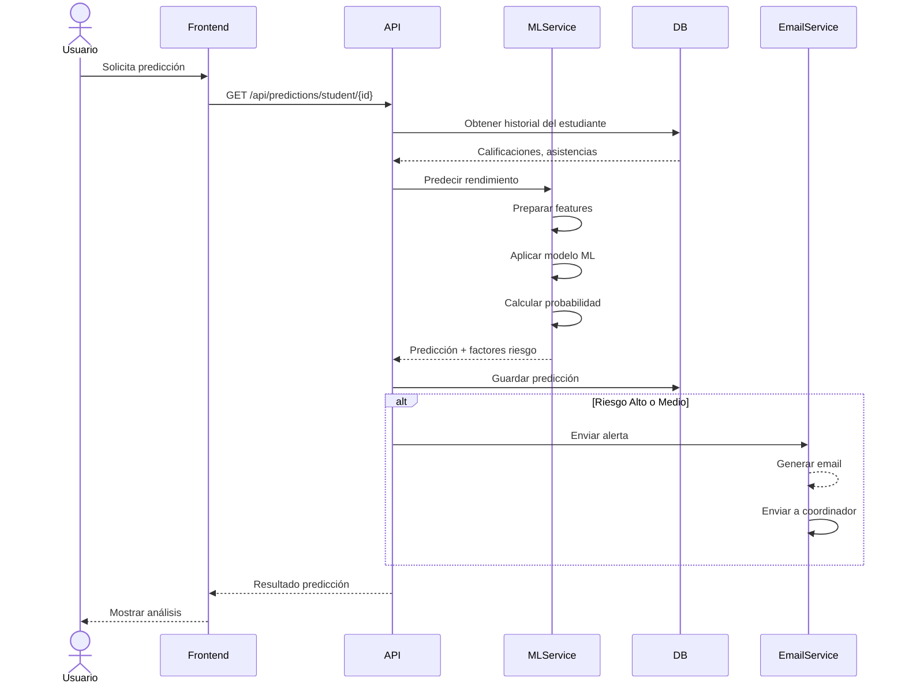
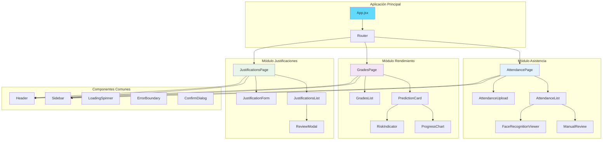

# arquitectura

# Diagramas del Sistema - Instituto Liceo Cristiano

## 1. Arquitectura General del Sistema



## 2. Diagrama de Base de Datos (Modelo Entidad-Relación)

```mermaid
erDiagram
    USUARIOS ||--o{ ESTUDIANTES : "gestiona"
    USUARIOS {
        int id PK
        varchar email UK
        varchar password_hash
        varchar nombre
        varchar apellido
        enum rol
        datetime created_at
        datetime updated_at
    }
    
    CURSOS ||--o{ ESTUDIANTES : "pertenecen"
    CURSOS {
        int id PK
        varchar nombre
        varchar codigo UK
        int grado
        varchar seccion
        int año_academico
        datetime created_at
    }
    
    ESTUDIANTES ||--o{ ASISTENCIAS : "tiene"
    ESTUDIANTES ||--o{ CALIFICACIONES : "obtiene"
    ESTUDIANTES ||--o{ JUSTIFICACIONES : "solicita"
    ESTUDIANTES ||--|| ROSTROS : "tiene"
    ESTUDIANTES {
        int id PK
        varchar rut UK
        varchar nombre
        varchar apellido
        date fecha_nacimiento
        varchar email
        varchar telefono
        int curso_id FK
        varchar foto_perfil
        enum estado
        datetime created_at
        datetime updated_at
    }
    
    ASISTENCIAS ||--|| ESTUDIANTES : "registra"
    ASISTENCIAS {
        int id PK
        int estudiante_id FK
        date fecha
        time hora_entrada
        enum estado
        varchar foto_asistencia
        float confianza_reconocimiento
        int registrado_por FK
        datetime created_at
    }
    
    MATERIAS ||--o{ CALIFICACIONES : "contiene"
    MATERIAS {
        int id PK
        varchar nombre
        varchar codigo UK
        int curso_id FK
        int creditos
        datetime created_at
    }
    
    CALIFICACIONES ||--|| ESTUDIANTES : "pertenece"
    CALIFICACIONES ||--|| MATERIAS : "de"
    CALIFICACIONES {
        int id PK
        int estudiante_id FK
        int materia_id FK
        decimal nota
        int periodo
        enum tipo_evaluacion
        date fecha_evaluacion
        text observaciones
        datetime created_at
    }
    
    JUSTIFICACIONES ||--|| ESTUDIANTES : "de"
    JUSTIFICACIONES ||--o{ USUARIOS : "aprueba"
    JUSTIFICACIONES {
        int id PK
        int estudiante_id FK
        date fecha_inicio
        date fecha_fin
        text motivo
        varchar certificado_url
        enum estado
        int revisado_por FK
        datetime fecha_revision
        text comentario_revision
        datetime created_at
        datetime updated_at
    }
    
    ROSTROS {
        int id PK
        int estudiante_id FK UK
        text encoding_facial
        varchar foto_original
        datetime fecha_registro
        datetime updated_at
    }
    
    PREDICCIONES_ACADEMICAS ||--|| ESTUDIANTES : "para"
    PREDICCIONES_ACADEMICAS ||--|| MATERIAS : "en"
    PREDICCIONES_ACADEMICAS {
        int id PK
        int estudiante_id FK
        int materia_id FK
        float probabilidad_aprobacion
        enum prediccion
        json factores_riesgo
        date fecha_prediccion
        varchar modelo_version
        datetime created_at
    }
    
    PERIODOS_ACADEMICOS ||--o{ CALIFICACIONES : "contiene"
    PERIODOS_ACADEMICOS {
        int id PK
        varchar nombre
        date fecha_inicio
        date fecha_fin
        int año
        enum estado
    }
```

## 3. Diagrama de Flujo - Módulo de Asistencia con Reconocimiento Facial



## 4. Diagrama de Flujo - Predicción de Rendimiento Académico



## 5. Diagrama de Flujo - Justificación de Faltas



## 6. Estructura del Backend (Python)



## 7. Estructura del Frontend (React + Vite)



## 8. Diagrama de Secuencia - Reconocimiento Facial



## 9. Diagrama de Secuencia - Predicción Académica



## 10. Diagrama de Componentes React


```
